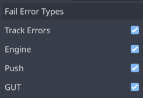

# Error Tracking

Godot introduced the ability to detect errors in version 4.5.  Godot errors are not thrown and will not bubble up.  Sometimes they cause execution of the current method to abruptly end, other times it may not.  GUT records all the errors that occur during the execution of tests and then fails a test if any occurred that were not "handled".  GUT does not fail at the exact line that caused the error, it fails after the test has finished executing.  It's all a bit unwieldy but way better than not being able to detect that an error occurred.

If an error occurs while a test is running, GUT now fails that test.  There are three different kinds of errors that GUT can detect.
* Internal GUT errors
* Calls to `push_error`
* Engine errors (Script/Shader/Godot errors)


## "Handling" Expected Errors
GUT provides a few different ways to "handle" errors engine and push_error errors.  You can also enable/disable failing for errors (see below).

To assert that a test has NOT occurred, simply call `pass_test` or assert on the size of the results of `get_errors`.

All errors will always appear in the output.

#### <a href="class_ref/class_guttest.html#class-guttest-method-assert-engine-error">assert_engine_error</a>

<a href="class_ref/class_guttest.html#class-guttest-method-assert-engine-error">assert_engine_error</a> can be used in tests to "handle" errors and prevent them from causing a failure.  In addition it will cause the test to fail if the expected error has not occurred.

An engine error is any error generated by the engine that does NOT originate from `push_error`.

You can assert that an expected count of errors occurred, or that an error occured containing specific text.

See the method for more information.


#### <a href="class_ref/class_guttest.html#class-guttest-method-assert-push-error">assert_push_error</a>
<a href="class_ref/class_guttest.html#class-guttest-method-assert-push-error">assert_push_error</a> can be used int tests to "handle" errors and prevent them from causing a failure.  In addition it will cause the test to fail if the expected error has not occurred.

A push_error error is any error generated from `push_error`.  `push_error` errors are the closest thing we have to an application error.  You can use `push_error` in your game and then assert that the error happened during at test.

You can assert that an expected count of errors occurred, or that an error occured containing specific text.

See the method for more information.


#### <a href="class_ref/class_guttest.html#class-guttest-method-get-errors">get_errors</a>
You can also use `get_errors` to get all the errors and inspect them more closely and mark them as "handled".

It is not recommended that mix how you "handle" errors in a single test.  Setting the `handled` property of a `get_errors` error and then asserting an error has occurred will give unexpected results.

See the method for more information about the method and the returned data.


## Disabling Failing/Error Detection
You can prevent GUT from failing when it encounters an error or prevent the detection all together.  When failures are disabled, you can still assert that errors have occured.  If you disable the error detection then error assertions will always fail.


### Via the Editor
These options can be found in the GutPanel options.  Track Errors disables the error tracking systm (same as `no_error_tracking` below).  "Engine", "Push", and "GUT" enable/disable whether that error type causes a test to fail.




### Via .gutconfig.json File
`failure_error_types` holds a list of the error types that will cause failures.  An empty list means no error types will cause failures.  Invalid values are ignored.  Values are case sensitive.  This is the default entry which contains all errors.  This should only be specified in your file if you want to disable an error type.
```json
failure_error_types = ["engine", "gut", "push_error"]
```

`no_error_tracking` can be used to disable the error detection system.  GUT errors will still be detected (they are handled differently).
```json
no_error_tracking = true,
```


### Via the CLI
There are also command line options for these, see the command line help for more information.


## See Also
This is my first pass at adding error detection/assertions to GUT.  Please open an issue if you have additional ideas.

* <a href><a href="class_ref/class_guttrackederror.html">GutTrackedError</a>