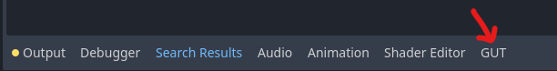
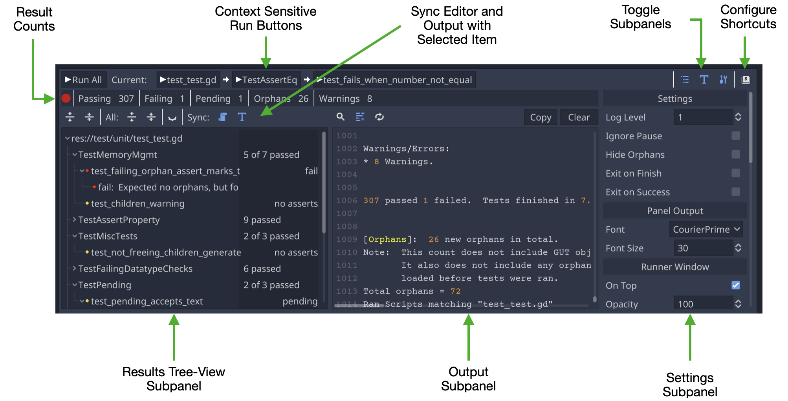

# Install
GUT is a Godot Plugin.  You can download it directly or install it from the Asset Lib in the Godot Editor.

## Installing from in-editor Godot Asset Lib
1.  Click the AssetLib button at the top of the editor
1.  Search for "Gut"
1.  Click it.
1.  Click "Install".  This will kick off the download.
1.  Click the 2nd "Install" button that appears when the download finishes.  It will be in a little dialog at the bottom of the AssetLib window.
1.  Click the 3rd "Install" button.
1.  You did it!

Finish the install by following the instructions in [Setup](#setup) below.

## Download and install
Download the zip from the [releases](https://github.com/bitwes/gut/releases) or from the [Godot Asset Library](https://godotengine.org/asset-library/asset/54).

Extract the zip and place the `gut` directory into your `addons` directory in your project.  If you don't have an `addons` folder at the root of your project, then make one and THEN put the `gut` directory in there.

Finish the install by following the instructions in Setup below.

## Installing as git submodule
Because GUT is developed in the `res://addons/gut` directory of this project, resources in this repository are referenced as `res://addons/gut/...`. If this repository is installed as a git submodule in `res://addons`, those paths are now invalid, as the path to them would now be `res://addons/gut/addons/gut/...`.

In order to install GUT as a git submodule, then, you can use a single symlink to keep all the resource paths in GUT valid. Follow these steps:
1. Add GUT as a git submodule (`git submodule add https://github.com/bitwes/Gut.git <submodule location>`).
2. Symlink GUT's source to your project's addons (`ln -s <submodule location>/addons/gut addons/gut`).

Godot (as of version 4.4) will detect that the submodule contains a Godot project and will give a warning noting that it will not attempt to parse this folder (which also means that the submodule will not show up in Godot's file tree). However, because the symlink you've created goes into GUT's source and skips the project file, Godot will parse GUT's source and you can use it like normal.

If you'd prefer not to see this warning, you can manually tell Godot not to parse the submodule by placing the submodule in a directory and adding an empty file named `.gdignore` in that directory.

## Setup
### Activate
1.  From the menu choose Project->Project Settings, click the Plugins tab and activate Gut.  Once activated, the GUT Panel will appear at the bottom of your editor:

### Setup directories for tests
The next few steps cover the suggested configuration.  Feel free to deviate where you see fit.

1.  Create directories to store your tests and test related code (suggested config)
	* `res://test`
	* `res://test/unit`
	* `res://test/integration`

## Running Tests

### Run tests from the GUT Panel
Set the test directories in the settings subpanel (below) and click "Run All".  That's all there is to it.

### Run tests from the command line
GUT comes with a command line interface, more info can be found on the [Command Line](Command-Line) page.

### Run tests through VSCode
There is also a VSCode plugin that you can use to run tests directly from VSCode.  You can find the plugin and related documentation [here](https://github.com/bitwes/gut-extension).

## Where to next?
* [Quick Start](Quick-Start)
* [Creating Tests](Creating-Tests)
* [Command Line](Command-Line)

