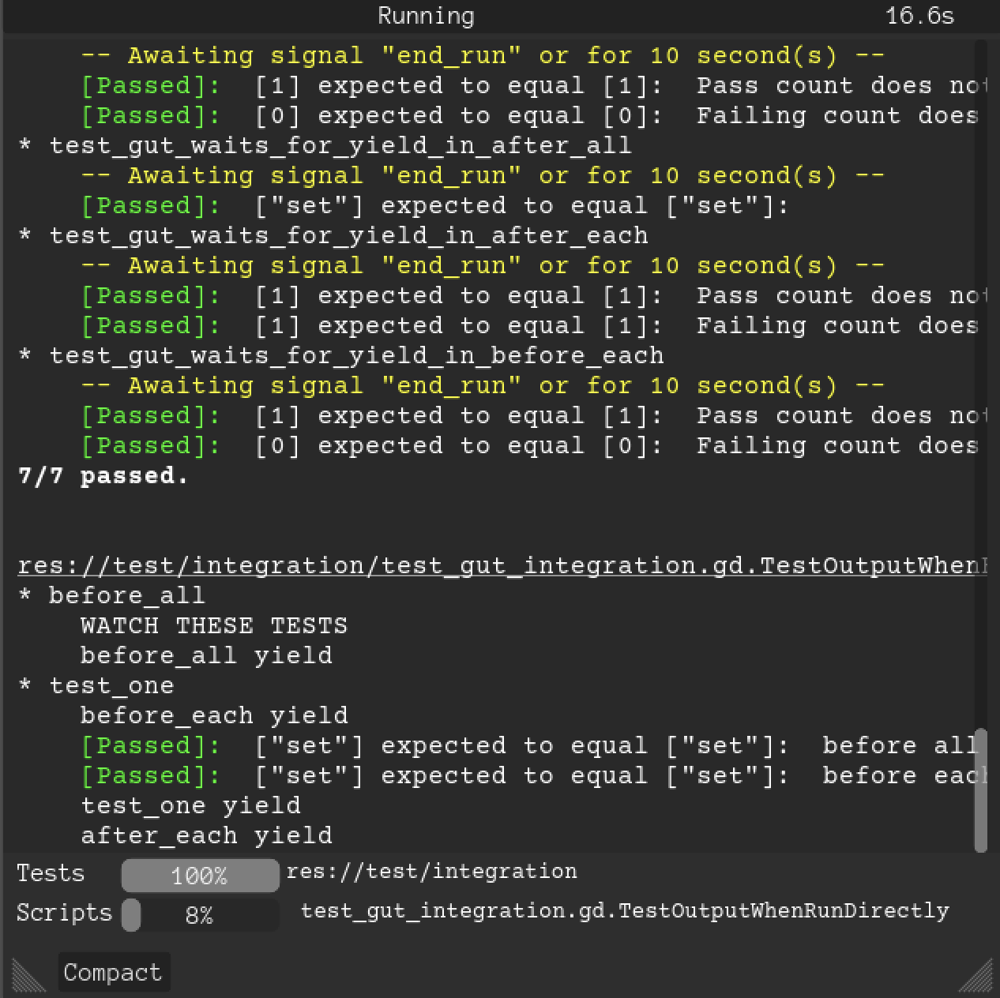

.. toctree::
   :hidden:
   :maxdepth: 3
   :caption: Getting Started
   :name: sec-started

   New-For-Godot-4
   Install
   Quick-Start
   Command-Line

.. toctree::
   :hidden:
   :caption: GutTest
   :name: sec-guttest

   Creating-Tests
   Asserts-and-Methods
   Awaiting
   Inner-Test-Classes
   Parameterized-Tests
   Simulate
   Comparing-Things

.. toctree::
   :hidden:
   :maxdepth: 1
   :caption: Doubling
   :name: sec-doubles

   Doubles
   Partial-Doubles
   Double-Strategy
   Stubbing
   Spies

.. toctree::
   :hidden:
   :maxdepth: 1
   :caption: Mocking Input
   :name: sec-mockinput

   Mocking-Input
   Input-Sender
   Input-Factory

.. toctree::
   :hidden:
   :maxdepth: 1
   :caption: Other
   :name: sec-other

   Contributing
   GDScript-Warnings
   Export-Test-Results
   Hooks
   Memory-Management
   Orphans
   Running-On-Devices
   Tutorials

.. toctree::
   :hidden:
   :maxdepth: 1
   :caption: ClassRef
   :name: class-ref
   :glob:

   class_ref/*

Gut 9.3.0 (Godot 4.2)
=========
GUT (Godot Unit Test) is a utility for writing tests for your Godot Engine game.  It allows you to write tests for your gdscripts in gdscript.

Godot 3.x/4.x
--------------
GUT 9 requires Godot 4.  GUT 7 requires Godot 3.4.

Getting Started
----------------

* :doc:`Quick-Start <Quick-Start>`
* :doc:`Install <Install>`
* :doc:`Asserts and Methods <Asserts-and-Methods>`
* :doc:`Creating Tests <Creating-Tests>`
* :doc:`Using Gut at the command line <Command-Line>`

Advanced Testing
----------------

* :doc:`Inner Test Classes <Inner-Test-Classes>`
* :doc:`Doubling <Doubles>`
* :doc:`Spies <Spies>`
* :doc:`Stubbing <Stubbing>`
* :doc:`Parameterized Tests <Parameterized-Tests>`
* :doc:`Simulate <Simulate>`
* :doc:`Coroutines and await in tests <Awaiting>`
* :doc:`Pre/Post Run Hooks <Hooks>`
* :doc:`Exporting Results <Export-Test-Results>`

Editor GUI
----------

.. image:: _static/images/gut_panel.png

GUT GUI
-------

Normal

Compact

.. image:: _static/images/GuiCompact.png

Engine Warnings
---------------

There are a fair number of warnings that Godot will show related to GUT.  Some of the warnings are valid and are being cleaned up overtime.  Most of the warnings are not valid and sometimes relate to generated code.  As of 3.2 you can disable warnings for addons, and it recommended you do so.

.. image:: _static/images/exclude_addons.png

License
-------

Gut is provided under the MIT license.  [The license is distributed with Gut so it is in the `addons/gut` folder](https://github.com/bitwes/Gut/blob/master/addons/gut/LICENSE.md).

Contributing
------------

:doc:`Contributing <Contributing>`

Indices and tables
==================

* :ref:`genindex`
* :ref:`search`

