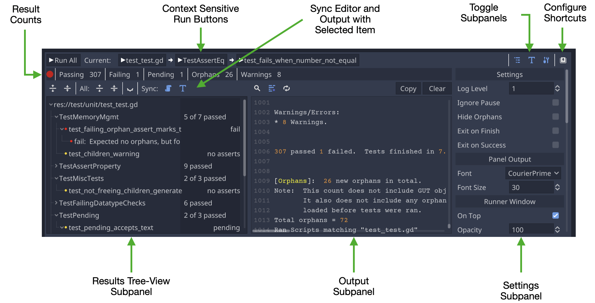

This wiki is being updated for the changes made for Godot 4.  Any pages with a warning at the top have not been updated yet.  For information about the changes in GUT 9 view  <a href="New-For-Godot-4.html">New-ForGodot-4</a>.

# Gut 9.1.1 (Godot 4.1)
GUT (Godot Unit Test) is a utility for writing tests for your Godot Engine game.  It allows you to write tests for your gdscripts in gdscript.

### Godot 3.x/4.x
GUT 9 requires Godot 4.  GUT 7 requires Godot 3.4.

# Getting Started
* [Quick Start](Quick-Start)
* [Install](Install)
* [Asserts and Methods](Asserts-and-Methods)
* [Creating Tests](Creating-Tests)
* [Gut Settings and Methods](Gut-Settings-And-Methods)
* [Using Gut at the command line](Command-Line)

# Advanced Testing
* [Inner Test Classes](Inner-Test-Classes)
* [Doubling](Doubles)
* [Spies](Spies)
* [Stubbing](Stubbing)
* [Parameterized Tests](Parameterized-Tests)
* [Simulate](Simulate)
* [Coroutines and `await` in tests](Awaiting)
* [Pre/Post Run Hooks](Hooks)
* [Exporting Results](Export-Test-Results)

# Editor GUI

# Engine Warnings
There are a fair number of warnings that Godot will show related to GUT.  Some of the warnings are valid and are being cleaned up overtime.  Most of the warnings are not valid and sometimes relate to generated code.  You can disable warnings for addons, and it recommended you do so.

# License
Gut is provided under the MIT license.  [The license is distributed with Gut so it is in the `addons/gut` folder](https://github.com/bitwes/Gut/blob/master/addons/gut/LICENSE.md).

# Contributing
[Contributing](Contributing)

# Who do I talk to?
You can talk to me, Butch Wesley

* GitHub:  bitwes
* Godot Discord:  bitwes
